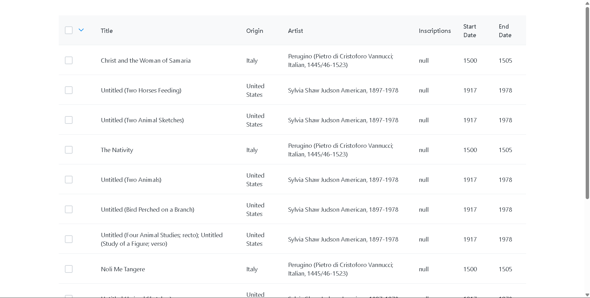
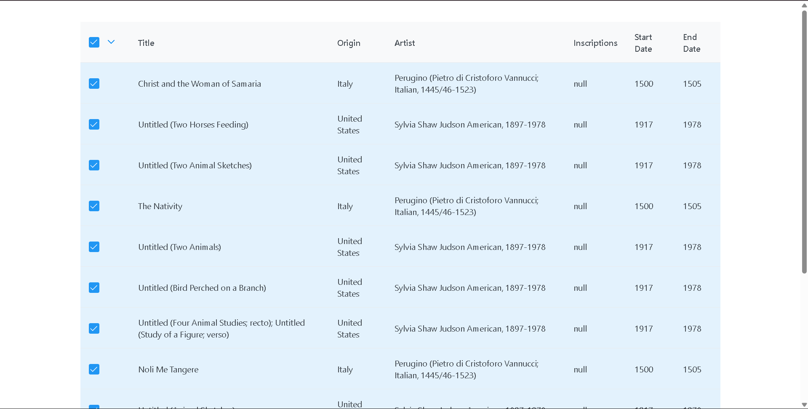
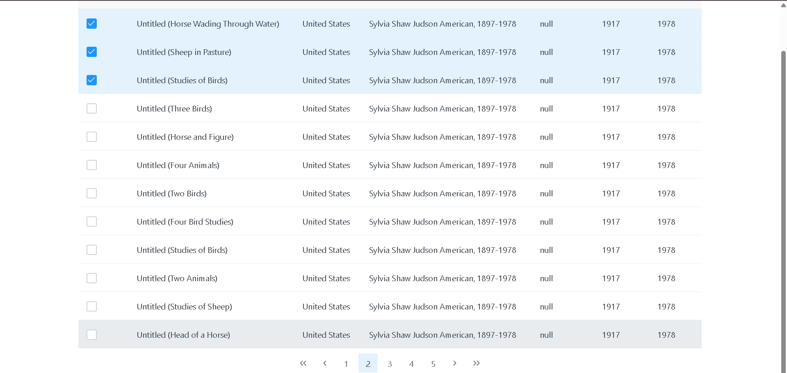

# Smart Data Selector

A React-based data table application that allows users to browse and select artworks from the Art Institute of Chicago API with advanced multi-page selection capabilities.


##  Features

- **Paginated Data Table**: Browse through thousands of artworks with server-side pagination
- **Multi-Page Selection**: Select rows across multiple pages seamlessly
- **Bulk Selection**: Select a specific number of rows (e.g., 25 rows) with a single click
- **Persistent Selection**: Selected rows remain highlighted when navigating between pages
- **Responsive UI**: Clean and modern interface using PrimeReact components
- **URL State Management**: Page state is preserved in the URL for easy sharing and navigation
- **TypeScript**: Full type safety across the application

## 🎥 Demo Video

Watch the application in action:

https://github.com/user-attachments/assets/your-video-id-here

*👆 Replace with your demo video - Upload a video to GitHub issues/discussions and paste the URL here*

**Or embed from YouTube:**
```markdown
[](https://www.youtube.com/watch?v=YOUR_VIDEO_ID)
```

##  Screenshots

### Main Data Table

*Browse and select artworks with pagination*

### Bulk Selection Feature

*Select multiple rows across pages using the dropdown menu*

### Multi-Page Selection

*Selected rows persist across different pages*

##  Tech Stack

- **React 19** - UI library
- **TypeScript 5.8** - Type safety
- **Vite 7** - Build tool and dev server
- **PrimeReact 10** - UI component library
- **Axios** - HTTP client
- **React Router DOM 7** - Routing and navigation
- **Art Institute of Chicago API** - Data source

##  Project Structure

```
growMeOrganic/
├── public/
│   └── vite.svg
├── screenshots/              # Application screenshots (add later)
│   ├── banner.png
│   ├── main-table.png
│   ├── bulk-selection.png
│   └── multi-page-selection.png
├── src/
│   ├── components/
│   │   └── Datatable.tsx    # Main data table component with selection logic
│   ├── services/
│   │   └── api.ts           # API integration with Art Institute of Chicago
│   ├── App.tsx              # Root component with routing
│   ├── App.css              # Global styles
│   ├── main.tsx             # Application entry point
│   └── index.css            # Base CSS styles
├── eslint.config.js          # ESLint configuration
├── index.html                # HTML entry point
├── package.json              # Dependencies and scripts
├── tsconfig.json             # TypeScript configuration
├── tsconfig.app.json         # TypeScript app configuration
├── tsconfig.node.json        # TypeScript node configuration
├── vite.config.ts            # Vite configuration
└── README.md                 # This file
```

##  Getting Started

### Prerequisites

- Node.js (v18 or higher)
- npm or yarn

### Installation

1. **Clone the repository**
   ```bash
   git clone <https://github.com/Ananta2545/growMeOrganic.git>
   cd growMeOrganic
   ```

2. **Install dependencies**
   ```bash
   npm install
   ```

3. **Start the development server**
   ```bash
   npm run dev
   ```

4. **Open your browser**
   Navigate to `http://localhost:5173`

##  Available Scripts

| Script | Description |
|--------|-------------|
| `npm run dev` | Start development server |
| `npm run build` | Build for production |
| `npm run preview` | Preview production build |
| `npm run lint` | Run ESLint |

##  Usage

### Basic Selection
- Click on individual checkboxes to select rows
- Use the header checkbox to select/deselect all rows on the current page

### Bulk Selection
1. Click the dropdown arrow (▼) in the header
2. Enter the number of rows you want to select
3. Click "Submit"
4. The specified number of rows will be selected starting from page 1

### Navigation
- Use pagination controls at the bottom to navigate between pages
- Selected rows persist across page changes
- Page number is reflected in the URL for easy sharing

##  API Integration

This application uses the [Art Institute of Chicago API](https://api.artic.edu/docs/) to fetch artwork data.

**Endpoint**: `https://api.artic.edu/api/v1/artworks`

**Data Fields**:
- Title
- Place of Origin
- Artist Display
- Inscriptions
- Start Date
- End Date

##  Architecture

### Component Structure

```
App
└── Datatable
    ├── DataTable (PrimeReact)
    │   ├── Column (Selection)
    │   ├── Column (Title)
    │   ├── Column (Origin)
    │   ├── Column (Artist)
    │   ├── Column (Inscriptions)
    │   ├── Column (Start Date)
    │   └── Column (End Date)
    ├── OverlayPanel (Bulk Selection)
    │   ├── Input (Number)
    │   └── Button (Submit)
    └── Paginator
```

### State Management

- **data**: Current page's artwork data
- **selectedRows**: Record of all selected rows across pages (keyed by seqId)
- **page**: Current page number
- **totalRecords**: Total number of records from API
- **pagination**: Number of rows per page
- **allRows**: Cache of all fetched rows (for bulk selection)

### Key Implementation Details

- **Sequential IDs**: Each row is assigned a `seqId` (1, 2, 3...) for consistent selection across pages
- **Lazy Loading**: Additional pages are fetched only when needed for bulk selection
- **URL Synchronization**: Page state is kept in sync with URL query parameters

##  Deployment

Deployed on netlify: <https://smart-data-selector.netlify.app/>


##  Known Issues

- None at the moment

##  Author

**Ananta Chattapadhyay**

##  Acknowledgments

- [Art Institute of Chicago](https://www.artic.edu/) for providing the free API
- [PrimeReact](https://primereact.org/) for the excellent UI components
- [React](https://react.dev/) team for the amazing framework

##  Support

For support, open an issue in the repository.

---

Made with ❤️ using React + TypeScript + Vite
